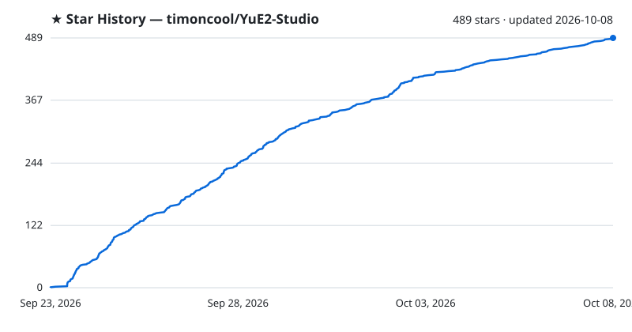

<div align="center">

<!-- studio family tabs -->
[](https://github.com/timoncool/YuE2-Studio) [](https://github.com/timoncool/MiniMax-Music3-Studio) [](https://github.com/timoncool/ACE-Step-Studio)


# YuE2 Studio

**Full songs with an editable score, generated on your own GPU. One executable — no Python, no Node.js, no launcher.**

[](https://timoncool.github.io/YuE2-Studio/)
[](https://github.com/timoncool/YuE2-Studio/releases/latest)
[](DONATE.md)

[](LICENSE)
[](https://github.com/timoncool/YuE2-Studio/stargazers)
[](https://github.com/timoncool/YuE2-Studio/commits/main)
[](https://github.com/timoncool/YuE2-Studio/releases)

**English** · [Русский](https://timoncool.github.io/YuE2-Studio/ru.html) · [中文](https://timoncool.github.io/YuE2-Studio/zh.html) · [日本語](https://timoncool.github.io/YuE2-Studio/ja.html) · [한국어](https://timoncool.github.io/YuE2-Studio/ko.html)


</div>

YuE2 Studio is a desktop studio for **YuE2**, the open song model from M-A-P that writes a
score before it sings. Describe a style, write the lyrics, and the model composes a melody
with chords as sheet music, then performs it as a full song with vocals. The score comes
back with the track: read it, edit it, and render the same composition again with a
different sound. Windows installer with auto-update or a portable folder, runs offline on
an NVIDIA card with 6 GB of VRAM or more; AMD and Intel cards through Vulkan are experimental.

It is built on [yue2.cpp](https://github.com/ServeurpersoCom/yue2.cpp), the native C++/CUDA
port of YuE2. The studio around it is Rust and React in a Tauri window — nothing in the
runtime path is Python.

## For AI agents

Given this repository, an agent can set everything up and drive the studio by itself:

1. Install the studio from the [latest release](https://github.com/timoncool/YuE2-Studio/releases/latest) and start it.
2. Connect to its MCP server at `http://127.0.0.1:8791/mcp`:
   `claude mcp add --transport http yue2-studio http://127.0.0.1:8791/mcp`
3. Read the skill it serves (resource `studio://skill`, prompt `studio`), the same text as
   [docs/mcp-skill.md](docs/mcp-skill.md), and start with the tool `studio_status`.

[llms.txt](llms.txt) says the same for tools that look for it. To keep the skill in Claude
Code, save [docs/mcp-skill.md](docs/mcp-skill.md) as `~/.claude/skills/yue2-studio/SKILL.md`.

## What you can do

- **A player of its own** — a ten-band equalizer on Winamp's frequencies with its presets,
  your own and .EQF files; a MilkDrop visualiser with hundreds of presets or a spectrum in ten
  looks, over the studio, fullscreen or in its own window; and a Winamp mode that turns the whole
  window into a skinned Winamp 2 whose windows move apart, dock and resize — the original skin
  and ten more included, sharp at any scale, the Winamp Skin Museum one click away,
  Ctrl+M to switch. The song, its place and the equalizer carry over both ways.
- **Save as, and a Files panel** — songs, stems, MIDI, lyric sheets, scores and videos are
  saved where you say, in Windows' own Save dialog, and the Files panel shows each save.
- **A proxy for the whole studio** — HTTP, HTTPS, SOCKS5 or SOCKS4, with a login: model
  downloads, Hugging Face, OpenRouter and updates go through it.
- **Full songs from a style and lyrics** — up to six minutes, in the languages the model
  sings. On an RTX 4090 with the Q8_0 set a 3:38 song renders in about 46 seconds.
- **Read and edit the score** — the model writes its composition in ABC notation first; the
  studio engraves it as sheet music. Edit the notes, tempo or key and create again: the
  composition stays, the performance changes. Or switch to melody-only, or no score at all.
- **Compose the score first** — write only the score from the style and lyrics, without
  singing it (the studio's take on yue2.cpp's `yue-plan`), read and fix it, then create.
- **Covers** — SheetSage2 listens to a recording and writes its melody as a score; YuE2
  then sings that melody in your style. The words have to fit the melody: the original
  lyrics work best, new ones need the same syllables line by line with the stresses on
  the same notes, or the singing drifts off the tune — lines stretch, pause and slide into
  the wrong section. Transcription mistakes carry into the cover too. A track from your
  library can be transcribed from its menu.
- **Exact replay** — every track keeps its request and its audio codes, so it can be
  re-rendered bit for bit, or re-rendered with other steps, a new sound seed, several
  variations, or another output format, without composing again.
- **110 ready examples** — the style/lyrics/score sets that ship with yue2.cpp, covers
  included, one click to load.
- **Every engine setting** — all seven sampling knobs (temperature, top-p, top-k,
  repetition penalty and its window, minimum and maximum tokens) for the score and for the
  audio codes, flow-matching steps, guidance, both seeds, peak normalisation, MP3 or
  16/24/32-bit WAV. Prompts open and save as JSON or YAML in the engine's own request
  format, so they move freely between the studio, the yue2.cpp WebUI and `yue-synth`.
- **Structured song writing** — build a style from its musical fields and arrange lyrics in editable sections, while keeping the plain text editable. Give the writing assistant a language, a target of 8–32 lines and additional instructions.
- **Song and render controls** — voice and tempo fields; section, line/stanza and text-case tools; Keep/Words lyric preservation and exact checkpoint tokens; batch score-plan selection and chord mirroring in repeated sections. Edit scores with MIDI grid and octave controls. Transpose generation by −24 to +24 semitones, render vocals only through native HT-Demucs as MP3 or 32-bit WAV, and switch each LoRA on or off with weights from −10 to +10.
- **A writing assistant** — a local Gemma model or OpenRouter writes the style and lyrics
  from an idea and edits the score on request; or pick your connected agent (MCP) and it
  writes instead. Lyrics you wrote yourself get their section tags with one button, the
  words exactly as you wrote them.
- **Word-level karaoke** — enhanced LRC with a timestamp on every word, aligned by Parakeet
  or Whisper. Your lyrics are kept; only the timing is borrowed.
- **Six stems on the GPU** — drums, bass, other, vocals, guitar and piano with HT-Demucs.
- **Any track to MIDI** — a song, a stem or a processed take becomes multi-instrument MIDI
  (34 instrument groups and drums) with MuScriptor on the GPU, through HOT-Step's native
  port. A piano roll fills in while it listens; play it against the original, mute or solo
  an instrument, save the .mid. Downloaded the first time it is used.
- **A MIDI editor** — a piano roll with tracks, instruments and drums: play a song in from a
  MIDI keyboard or the computer's keys, record or draw it, edit a track's MIDI, save it to the
  library as a track and send it to a cover, or open the create form's score in it. A .mid
  file becomes the score: the voice and instrument chosen, chords read or guessed, karaoke
  words offered for the lyrics.
- **Every result is a track** — stems, a processed take, a re-render and a cover land in the
  library as tracks of their own, each marked with the one it was made from and keeping the
  settings it was made with.
- **LoRA** — LoRA and LoKr files for either half of the model, the composition or the
  sound, each with its own strength, picked in the create form. A catalogue of ready ones
  with their authors credited, and a search on Hugging Face that downloads what you pick.
- **Train your own LoRA** — an optional tab on the LoRA page: songs of one artist or
  style become a LoRA on your own card with HOT-Step's trainer and its tuned recipe (LoKr,
  Prodigy, lyric timing from a forced aligner that also reads Cyrillic). Every setting of
  the recipe is editable. Datasets move between this studio and MiniMax Music3 Studio as a
  folder, and each saved checkpoint goes into the LoRA library in one click.
  - **A three-step wizard** — drop a folder of songs, check them, train. Albums with a
    cue sheet are cut into songs; titles and artists come from the tags, the file name and
    the folders.
  - **Preparation on its own** — lyrics come from the lyric databases players use (LRCLIB,
    QQ Music, Kugou), word for word; only a song none of them knows has its vocals
    separated and is heard by Whisper, with its usual hallucinations filtered out. The
    assistant lays the lyrics out in sections. MOSS-Music listens to every song and the
    assistant writes its style, with the tempo measured by Beat This! on the card.
  - **Every song shows where it is** — the lyrics and styles appear as each song is done,
    one model on the card at a time, each loaded once for the whole batch. A song that
    failed or was stopped has a button that finishes just that song.
  - **Picks up after a restart** — each song keeps what it has; a preparation cut off by a
    crash or a restart carries on by itself and redoes nothing.
  - **Stop by drift or by epochs** — stop when the composition half drifts too far from
    the base, or after a set number of passes over the songs.
  - **A trigger word from the start** — every dataset gets a rare word made from its name,
    which you can change.
  - **Train further** — not there yet at 750 steps? Set 1000 and the run goes on from its
    latest checkpoint with the same recipe and songs; the loss chart and the checkpoints
    continue instead of starting over.
- **Audio processing** — noise reduction, the Spectral Lifter, a vocal naturaliser, your
  own VST3 plugins in a chain, and mastering to a reference track. Compare before and
  after while it plays, then keep the result as a version of the track or throw it away.
- **MP3 made by the studio** — the engine renders 32-bit float and the studio encodes the
  MP3 with LAME, so nothing is lost before the encoder.
- **A library of plain files** — search, playlists, cover art from prompt templates, MP3s
  exported with title, lyrics and cover in their ID3 tags. Interface in English, Russian,
  Chinese, Japanese and Korean.
- **A cover for every track** — a track without one wears a free (CC0) Wikimedia Commons
  photograph that fits the genres, moods and instruments of its style, a pattern in one of 21
  DiceBear styles, or a cover OpenRouter generates for every new track. It is chosen by the
  track's seed, so it stays the same, a stem wears its song's, and it is written into the MP3,
  so players show it after the download.
- **One picture window** — for a cover, and for the background and centre of a music video:
  Commons photographs by search starting from the scenes a style calls up, clips free of
  copyright for a background, the track's pattern in any style, generation through
  OpenRouter, or a file of your own. No keys, no stock-site accounts.
- **Music videos** — a visualiser video of any track in 16:9, 9:16 or 1:1, with karaoke
  lyrics, text layers and effects, rendered to MP4 on your machine.
- **Activity** — a log in the sidebar of every change a connected agent makes and every
  message the studio shows.
- **Likes, sorting and stems in order** — a like is kept with the song for every window and
  agent, every list sorts by date, title or length, and a song's stems fold under it.

## Compose and edit MIDI

The embedded Signal editor has multiple tracks, instruments, drums, MIDI keyboard recording, tempo changes, editable chord symbols and section markers. Save a new composition as MIDI and rendered audio in the library, or update an existing track’s MIDI. SoundFonts are bundled locally; the editor sends no analytics.

In YuE2, the same editor opens ABC scores and applies notes, chords and sections back to the create form. The visual editor replaces the older separate score editor. Use **Apply** to update the ABC score, or send a library MIDI track to cover mode.

## Screenshots


| | |
|---|---|
|  |  |
| The equalizer with its curve and MilkDrop over the studio, as the song plays | The whole window as Winamp 2: equalizer, playlist and MilkDrop, skinned |
|  |  |
| The score as sheet music and as ABC text — melody + chords, melody only, or none | A finished track — its lyrics and the score it was sung from, ready to reuse |
|  |  |
| Cover mode — pick a recording, SheetSage2 writes its melody down | Model sets — one quantisation per role, what is on disk, switch in one click |
|  |  |
| Any track to MIDI — a piano roll of every instrument, played against the original, with mute and solo | Your own LoRA trained on the card — loss and drift as it learns, a checkpoint every 50 steps |
|  |  |
| A dataset of 61 songs — lyrics found in the databases players use, styles written by ear | The LoRA catalogue — styles, artists and sound, each credited to its author |
|  |  |
| Audio processing — noise reduction, the Spectral Lifter, a vocal naturaliser, VST3, mastering | An agent over MCP — the address and the lines to paste into Claude Code or any client |

The same screens in the language you read: [Русский](https://timoncool.github.io/YuE2-Studio/ru.html),
[中文](https://timoncool.github.io/YuE2-Studio/zh.html), [日本語](https://timoncool.github.io/YuE2-Studio/ja.html),
[한국어](https://timoncool.github.io/YuE2-Studio/ko.html) — on the project page, or in
[docs/screenshots](docs/screenshots).

## Samples

Made in the released build on an RTX 4090 with the recommended BF16 set, nothing edited
afterwards. Listen in the browser on the [project page](https://timoncool.github.io/YuE2-Studio/#samples)
or download the MP3s from [docs/samples](docs/samples).

| Song | How it was made | Style |
|---|---|---|
| [Houseplant Party](docs/samples/houseplant-party.mp3) | English funk disco | funk disco, slap bass, wah guitar, brass, 118 BPM |
| [My Truck Talks Back](docs/samples/my-truck-talks-back.mp3) | Country | country, male baritone, pedal steel, fiddle, 96 BPM |
| [La Siesta](docs/samples/la-siesta.mp3) | Latin pop in Spanish | latin pop, nylon guitar, congas, piano montuno, 102 BPM |
| [外卖小哥](docs/samples/delivery-rider.mp3) | Mandarin city pop | city pop, electric piano, funky bass, 108 BPM |
| [月曜日のサムライ](docs/samples/monday-samurai.mp3) | Japanese rock, anime-opening style | j-rock, female voice, distorted guitars, 168 BPM |
| [Дача, лето, комары](docs/samples/dacha-leto-komary.mp3) | A full song from a style and lyrics | folk pop, warm male voice, accordion, 104 BPM |
| [Дача, лето, комары — джаз](docs/samples/dacha-jazz-cover.mp3) | Cover: SheetSage2 wrote down the melody of the song above, YuE2 sang it as jazz | vintage jazz swing, sultry female crooner, muted trumpet |
| [Понедельник](docs/samples/ponedelnik.mp3) | Blues rock, raspy voice | blues rock, overdriven guitar, hammond organ, 96 BPM |
| [Бабушка на дискотеке](docs/samples/babushka-na-diskoteke.mp3) | Re-rendered from its saved audio codes with 64 solver steps | disco pop, funky bass, string section, 120 BPM |
| [Борщ на орбите](docs/samples/borshch-na-orbite.mp3) | Ska punk | ska punk, brass section, offbeat guitar, 150 BPM |
| [Кот-программист](docs/samples/kot-programmist.mp3) | Synthwave pop, the second take | synthwave pop, analog synths, drum machine, 112 BPM |
| [Ночной вор Барсик](docs/samples/barsik.mp3) | Style and lyrics written by the built-in assistant from a one-line idea | pop-punk, distorted guitars, 185 BPM |

## What it needs

- Windows 10/11 x64.
- A GPU with **6 GB of VRAM** or more:
  - **NVIDIA**, from the GTX 900 series on, runs on CUDA — the fastest path. The studio
    ships two CUDA builds of the engine and picks the one your card and driver run:
    CUDA 13 for Turing and newer (GTX 16, RTX 20–50, Tesla T4, A100, RTX A-series,
    L4/L40, H100) with driver 580 or newer, CUDA 12 for Maxwell, Pascal and Volta
    (GTX 900/1000, Titan X/Xp/V, Tesla M40, P40, P100, V100) and for any card on a driver
    from 525 to 579. Both carry compiled code for every one of those architectures, so
    nothing is left for the driver to compile.
  - **AMD or Intel — experimental.** The engine runs on Vulkan through the card's own
    driver. The Vulkan path itself is verified on NVIDIA (the same words heard as on
    CUDA), but on AMD Radeon integrated graphics the song came out with unintelligible
    vocals, and discrete AMD and Intel cards are untested. Reports from owners are welcome.
  - Without a GPU the engine falls back to the processor, which works but is many times
    slower.
- 4–10 GB of disk for one model set.
- Training a LoRA (optional): an NVIDIA RTX 30-series card or newer with 11 GB of VRAM
  and about 8 GB more disk for the trainer and its weights, downloaded only when you open
  training. Describing songs by ear needs about 12 GB of VRAM and 10 GB more disk for
  MOSS-Music; without it the styles are written by hand.

## What runs where

| Part | NVIDIA | AMD, Intel | No graphics card |
| --- | --- | --- | --- |
| Making songs · yue2.cpp | CUDA | Vulkan | processor |
| Training a LoRA · music-train | CUDA | not available | not available |
| Style by ear · MOSS-Music | CUDA | processor | processor |
| Tempo · Beat This! | CUDA | DirectML | processor |
| Stems · HT-Demucs | CUDA | processor | processor |
| Karaoke timing · Parakeet | CUDA | DirectML | processor |
| Karaoke timing · Whisper | CUDA | processor | processor |
| Writing assistant · llama.cpp | CUDA | Vulkan | processor |
| Audio to MIDI · MuScriptor | CUDA | processor | processor |

**The paths for AMD and Intel cards (Vulkan, DirectML) and work on the processor are
experimental:** they exist for computers where the studio would not run at all otherwise.
The main, tested path is an NVIDIA card.

- Training needs an NVIDIA card with 11 GB of video memory or more. The trainer has no other
  path, and on the processor one run would take days, so on any other machine the studio
  does not offer the training files.
- On AMD and Intel cards stems are separated on the processor: the HT-Demucs model does not
  run through DirectML (out of memory on a 2 GB integrated card, over 20 GB and minutes for
  30 seconds of audio on a 24 GB one).
- Karaoke's Parakeet and the tempo model reach any DirectX 12 card through DirectML. Its
  runtime - ONNX Runtime 1.24.4 DirectML and DirectML 1.15.4, about 215 MB - comes with the
  card path; the studio loads its own DirectML rather than the older copy inside Windows.
- "Auto" in a device choice takes the card when its runtime is installed, and the processor
  otherwise. The same table is in the studio, under Settings → Models.

## Quick start

1. **Install** — run `YuE2.Studio_x.y.z_x64-setup.exe` from the
   [latest release](https://github.com/timoncool/YuE2-Studio/releases/latest), or unzip the
   portable archive anywhere and run `YuE2-Studio.exe`.
2. **Choose a model set** — the first screen preselects the set your card can run. Press
   download; it fetches only what is missing and resumes if interrupted.
3. **Create** — write a style and lyrics, or load one of the examples, and press Create.
   The engine starts by itself and the song lands in your library with its score.

Everything the studio owns stays in its own folder: models, songs, settings, logs,
temporary files and the WebView2 profile, beside `YuE2-Studio.exe`. That holds for the
portable archive and for an installation into any folder the studio can write to;
deleting the folder removes the studio. Only an installation into a read-only location
such as Program Files falls back to `%LOCALAPPDATA%\YuE2 Studio`. The installed version
updates itself: a new release is offered inside the studio and installed in place.

**If the installer stops on WebView2.** The studio's window runs on Microsoft Edge WebView2,
and the installer fetches it when Windows lacks it. On a blocked or unsteady connection, or on
Windows 10 builds that refuse Microsoft's small bootstrapper (error 0x80040902), that fetch
fails and the installer says so. Install WebView2 from Microsoft's standalone installer,
[Evergreen Standalone x64](https://go.microsoft.com/fwlink/p/?LinkId=2124701), then run the
studio's installer again.

## Drive it from an agent (MCP)

While the studio is open it serves MCP at `http://127.0.0.1:8791/mcp`: an agent such as
Claude Code, Claude Desktop or Cursor does everything the page does, through the same code -
songs and scores, the library, covers, stems, MIDI, karaoke, processing, video clips, the player,
LoRA, and a LoRA from a folder of songs end to end - and sees and works the window itself:
a screenshot, its controls, clicks and typing. 162 tools, grouped by area. The model's
writing rules and official examples come with the server, so the agent writes the styles,
lyrics and lyric layouts itself instead of the studio's small assistant.

With **Agent (MCP)** chosen as the writing assistant (Settings, Models), the connected agent
also answers the studio's own write buttons and dataset preparation. Settings, **Agent
(MCP)** shows whether an agent is connected and what to paste into the client.

```bash
claude mcp add --transport http yue2-studio http://127.0.0.1:8791/mcp
```

[docs/mcp-skill.md](docs/mcp-skill.md) is the skill an agent reads: every tool, what the
model expects, and step-by-step recipes.

## Models

A runnable YuE2 installation is a **backbone** (the 3B model that writes the score and the
audio codes) and the **VAE** (turns them into 48 kHz stereo). **SheetSage2** is optional:
without it the studio generates, but cannot transcribe recordings for covers.

Every set also carries the **decoder companion**, 134 MB: Mothersuperior's decoder adapter,
published as the pair of the tokenizer head the LoRA trainer turns songs into codes with. The
engine merges it under every render and the trainer keeps it frozen under every LoRA, so a LoRA
is trained on the decoder it is heard through. In HOT-Step's round trip of six real songs the
decoder without it narrowed the stereo (left/right correlation 0.78–0.92 against the
originals' ~0.65), with it 0.57–0.72.

| Your GPU | Set | Download |
| --- | --- | --- |
| 12 GB VRAM and above | Full native — BF16 backbone, original weights | 9.8 GB |
| 8 GB and above | Quality — Q8_0 backbone, near lossless | 5.1 GB |
| 7 GB and above | Balanced — Q6_K backbone | 4.1 GB |
| 5.5 GB and above | Light — Q5_K_M backbone | 3.8 GB |

Sizes include SheetSage2 at the matching quantisation and the decoder companion. The studio
detects your card and preselects the set, but the download is always your decision; the model
manager also builds a custom mix role by role. Q5_K_M is the lightest quantisation published
for YuE2.

The GGUF files come from [Serveurperso/YuE2-GGUF](https://huggingface.co/Serveurperso/YuE2-GGUF),
pinned to revision `64b030e`, the decoder companion from
[Mothersuperior/yue2-mothersuperior-realaudio-tokenizer-v4](https://huggingface.co/Mothersuperior/yue2-mothersuperior-realaudio-tokenizer-v4),
pinned to revision `e2e63d8`; all are checked by size and SHA-256. They are written to, and
can be dropped into by hand at:

- `<the studio's folder>\data\models\yue2-cpp\` — the portable folder, or the folder
  you installed into
- `%LOCALAPPDATA%\YuE2 Studio\models\yue2-cpp\` — only for an installation into a
  read-only location

A file placed by hand with the exact catalogue name is recognised and never downloaded again.

<details>
<summary><b>Every file, with direct download links</b></summary>

| File | Role | Size |
| --- | --- | --- |
| [`YuE2-3B-BF16.gguf`](https://huggingface.co/Serveurperso/YuE2-GGUF/resolve/64b030e3deb6e8150d2b7c0db641ef5a17eca8a3/YuE2-3B-BF16.gguf) | backbone | 6.67 GB |
| [`YuE2-3B-Q8_0.gguf`](https://huggingface.co/Serveurperso/YuE2-GGUF/resolve/64b030e3deb6e8150d2b7c0db641ef5a17eca8a3/YuE2-3B-Q8_0.gguf) | backbone | 3.55 GB |
| [`YuE2-3B-Q6_K.gguf`](https://huggingface.co/Serveurperso/YuE2-GGUF/resolve/64b030e3deb6e8150d2b7c0db641ef5a17eca8a3/YuE2-3B-Q6_K.gguf) | backbone | 2.74 GB |
| [`YuE2-3B-Q5_K_M.gguf`](https://huggingface.co/Serveurperso/YuE2-GGUF/resolve/64b030e3deb6e8150d2b7c0db641ef5a17eca8a3/YuE2-3B-Q5_K_M.gguf) | backbone | 2.44 GB |
| [`YuE2-Vae-F32.gguf`](https://huggingface.co/Serveurperso/YuE2-GGUF/resolve/64b030e3deb6e8150d2b7c0db641ef5a17eca8a3/YuE2-Vae-F32.gguf) | VAE, every set | 506 MB |
| [`SheetSage2-F32.gguf`](https://huggingface.co/Serveurperso/YuE2-GGUF/resolve/64b030e3deb6e8150d2b7c0db641ef5a17eca8a3/SheetSage2-F32.gguf) | transcriber | 2.52 GB |
| [`SheetSage2-Q8_0.gguf`](https://huggingface.co/Serveurperso/YuE2-GGUF/resolve/64b030e3deb6e8150d2b7c0db641ef5a17eca8a3/SheetSage2-Q8_0.gguf) | transcriber | 913 MB |
| [`SheetSage2-Q6_K.gguf`](https://huggingface.co/Serveurperso/YuE2-GGUF/resolve/64b030e3deb6e8150d2b7c0db641ef5a17eca8a3/SheetSage2-Q6_K.gguf) | transcriber | 776 MB |
| [`SheetSage2-Q5_K_M.gguf`](https://huggingface.co/Serveurperso/YuE2-GGUF/resolve/64b030e3deb6e8150d2b7c0db641ef5a17eca8a3/SheetSage2-Q5_K_M.gguf) | transcriber | 703 MB |
| [`nar_lora_joint_v9.safetensors`](https://huggingface.co/Mothersuperior/yue2-mothersuperior-realaudio-tokenizer-v4/resolve/e2e63d859f3af879baf1b4d4e9f22d1eeda6fde5/nar_lora_joint_v9.safetensors) | decoder companion, every set | 134 MB |

</details>

### Everything else the studio downloads

Each part is downloaded when you first use it, and each file can be downloaded by hand
and put into the studio's `data` folder — `<the studio's folder>\data\`, or
`%LOCALAPPDATA%\YuE2 Studio\` for an installation into a read-only location. A file with
the exact name in the listed folder is recognised and not downloaded again.

<details>
<summary><b>Training, listening, lyrics, stems and the assistant — direct links</b></summary>

**Training a LoRA** — [scragnog/YuE2-GGUF](https://huggingface.co/scragnog/YuE2-GGUF), pinned to `eb7de09`

| File | What for | Size | Put in `data\` |
| --- | --- | --- | --- |
| [`yue2_3b_int8_convrot.safetensors`](https://huggingface.co/scragnog/YuE2-GGUF/resolve/eb7de0903bf4dfbd14a2384ae0c0d14150cfa2c7/checkpoints/yue2_3b_int8_convrot.safetensors) | the model the LoRA is trained on | 3.69 GB | `training\models\` |
| [`yue2-vae-standard-f32.gguf`](https://huggingface.co/scragnog/YuE2-GGUF/resolve/eb7de0903bf4dfbd14a2384ae0c0d14150cfa2c7/yue2-vae-standard-f32.gguf) | audio to latents | 506 MB | `training\models\` |
| [`yue2-tok-f16.gguf`](https://huggingface.co/scragnog/YuE2-GGUF/resolve/eb7de0903bf4dfbd14a2384ae0c0d14150cfa2c7/yue2-tok-f16.gguf) | audio to codes | 1.13 GB | `training\models\` |
| [`sheetsage2-f16.gguf`](https://huggingface.co/scragnog/YuE2-GGUF/resolve/eb7de0903bf4dfbd14a2384ae0c0d14150cfa2c7/sheetsage2-f16.gguf) | the songs' scores | 1.27 GB | `training\models\` |
| [`mms-fa-f32.gguf`](https://huggingface.co/scragnog/YuE2-GGUF/resolve/eb7de0903bf4dfbd14a2384ae0c0d14150cfa2c7/mms-fa/mms-fa-f32.gguf) | lyric timing | 1.18 GB | `training\models\` |

**Describing songs by ear** (optional)

| File | What for | Size | Put in `data\` |
| --- | --- | --- | --- |
| [`moss-aud-f16.gguf`](https://huggingface.co/scragnog/MOSS-Music-8B-Instruct-GGUF/resolve/main/moss-aud-f16.gguf) | MOSS-Music-8B, the ear | 1.61 GB | `training\models\moss\` |
| [`moss-lm-q8_0.gguf`](https://huggingface.co/scragnog/MOSS-Music-8B-Instruct-GGUF/resolve/main/moss-lm-q8_0.gguf) | MOSS-Music-8B, the words | 8.11 GB | `training\models\moss\` |
| [`beat_this.onnx`](https://github.com/mosynthkey/beat_this_cpp/raw/main/onnx/beat_this.onnx) | Beat This!, the tempo | 79 MB | `training\models\audio-facts\` |

**Lyrics by ear** — only for songs no lyric database knows; pick one recogniser

| Files | What for | Size | Put in `data\` |
| --- | --- | --- | --- |
| [faster-whisper-large-v3](https://huggingface.co/Systran/faster-whisper-large-v3/tree/main): `config.json`, `model.bin`, `preprocessor_config.json`, `tokenizer.json`, `vocabulary.json` | Whisper large-v3 | 2.9 GB | `karaoke\models\whisper\faster-whisper-large-v3\` |
| [parakeet-tdt-0.6b-v3-onnx](https://huggingface.co/istupakov/parakeet-tdt-0.6b-v3-onnx/tree/main): `config.json`, `encoder-model.int8.onnx`, `decoder_joint-model.int8.onnx`, `nemo128.onnx`, `vocab.txt` | Parakeet, European languages | 0.7 GB | `karaoke\models\parakeet\` |

**Stems and vocals for recognition**

| File | What for | Size | Put in `data\` |
| --- | --- | --- | --- |
| [`htdemucs_6s_fp16weights.onnx`](https://huggingface.co/StemSplitio/htdemucs-6s-onnx/resolve/49df9b6989cf2150840ea65b0bef77a2e471b678/htdemucs_6s_fp16weights.onnx) | HT-Demucs, six stems | 130 MB | `separation\models\htdemucs\htdemucs_6s_fp16.onnx` (this name) |

**MIDI from audio** — the transcriber and one of the models

| File | What for | Size | Put in `data\` |
| --- | --- | --- | --- |
| [`music-midi-cuda-windows-x64.zip`](https://github.com/timoncool/YuE2-Studio/releases/download/music-midi-8a5e42c4/music-midi-cuda-windows-x64.zip) | HOT-Step's `ace-midi`, unpacked | 126 MB | `midi\runtime\music-midi\` |
| [muscriptor-small](https://huggingface.co/cocktailpeanut/muscriptor-small/tree/31a8f75d6a8b5383fd71ad1371dc1620389ab722): `config.json`, `model.safetensors` | fast, 103M | 0.4 GB | `midi\models\muscriptor-small\` |
| [muscriptor-medium](https://huggingface.co/cocktailpeanut/muscriptor-medium/tree/27246ba68bd4d8f98bdec10a6edf8d7cf42a8826): `config.json`, `model.safetensors` | balanced, 307M | 1.2 GB | `midi\models\muscriptor-medium\` |
| [muscriptor-large](https://huggingface.co/cocktailpeanut/muscriptor-large/tree/87f4bf981f56f90fb5043153b3f54af3c3053da9): `config.json`, `model.safetensors` | best, 1.4B | 5.5 GB | `midi\models\muscriptor-large\` |

MuScriptor by Kyutai & Mirelo, weights CC BY-NC 4.0 (non-commercial); the mirror carries the
official files byte for byte, without the Hugging Face sign-in.

**The writing assistant** — one of

| File | Size | Put in `data\` |
| --- | --- | --- |
| [`gemma-4-E4B_q4_0-it.gguf`](https://huggingface.co/google/gemma-4-E4B-it-qat-q4_0-gguf/resolve/main/gemma-4-E4B_q4_0-it.gguf) | 4.80 GB | `assistant\models\` |
| [`gemma-4-12b-it-qat-q4_0.gguf`](https://huggingface.co/google/gemma-4-12b-it-qat-q4_0-gguf/resolve/main/gemma-4-12b-it-qat-q4_0.gguf) | 6.50 GB | `assistant\models\` |

</details>

## The engine and the DLLs it needs

```text
yue-server.exe → ggml.dll, ggml-base.dll            shipped inside the app
  loads at run time, whichever the machine can use:
  ├─ ggml-cuda.dll     → cublas64_13.dll, cublasLt64_13.dll (downloaded once), nvcuda.dll (NVIDIA driver)
  ├─ ggml-vulkan.dll   → vulkan-1.dll (every AMD, Intel and NVIDIA driver)
  └─ ggml-cpu-*.dll    nine builds, from SSE4.2 to AVX-512; the best one for the processor is picked
  + msvcp140, vcruntime140, vcruntime140_1, vcomp140   Visual C++ runtime, shipped app-local
```

**Shipped inside the app.** `yue-server.exe`, every `ggml*.dll`, built from the pinned
yue2.cpp commit with all backends, and the Visual C++ runtime it needs live in
`resources\yue2-cpp\` beside the main executable. Nothing is installed into Windows. Settings → Local engine chooses the compute device: Auto (CUDA on NVIDIA,
Vulkan on AMD and Intel, the processor without a GPU), or CUDA, Vulkan or the processor
explicitly. On Vulkan the studio turns on the engine's FP16 clamp: without it AMD Radeon
integrated graphics rendered pure silence and the engine crashed encoding it.

**Downloaded once, on the first engine start — on NVIDIA only.**

| File(s) | Where from | Size | Why |
| --- | --- | --- | --- |
| `cublas64_13.dll`, `cublasLt64_13.dll` | NVIDIA's redistributable [`libcublas-windows-x86_64-13.5.1.27-archive.zip`](https://developer.download.nvidia.com/compute/cuda/redist/libcublas/windows-x86_64/libcublas-windows-x86_64-13.5.1.27-archive.zip) | 391 MB (zip) | The CUDA linear algebra `ggml-cuda.dll` is linked against; too large, and under NVIDIA's licence, to bundle. |

A machine with the CUDA 13 toolkit already has cuBLAS on its `PATH` and downloads nothing.
Behind a proxy, take the two DLLs from the archive's `bin\` folder and drop them next to
`yue-server.exe`; the studio finds and uses them.

## Architecture

```text
React UI ─┐
          ├─ YuE2-Studio.exe   (Tauri window + Rust/Axum service on 127.0.0.1:8791)
Rust axum ┘        │
                   ├─ yue2.cpp `yue-server`   (C++/CUDA, GGUF, 127.0.0.1:18087)
                   ├─ music-train.exe         (HOT-Step ace-train, LoRA training, optional)
                   └─ vst-host.exe            (HOT-Step VST3 host, a process of its own)
```

The service is compiled into the desktop binary. It supervises the engine process, restarts
it when you switch model sets, and imports finished songs itself, so a result is never lost
if the window was reloaded or closed mid-generation. Progress is read from the engine's own
log: score, audio codes, acoustic rendering, decoding.

## Building from source

```powershell
npm --prefix app install
npm --prefix desktop install
cargo test --workspace
npm --prefix app test
```

Developing the UI against a running service:

```powershell
cargo run -p music-server           # service on 127.0.0.1:8791
npm --prefix app run dev            # UI on 127.0.0.1:3791
```

The engine: `scripts/build-yue-runtime.ps1 -RuntimeBackend all` builds the pinned yue2.cpp
commit (`engines/yue2-cpp-source.json`) with runtime-loaded CUDA, Vulkan and CPU backends,
using CUDA 13, the Vulkan SDK, MSVC and Ninja. `scripts/build-release.ps1 -Version X.Y.Z` produces the NSIS installer, the
portable archive and the signed `latest.json` for the updater; it reads the signing key from
`TAURI_SIGNING_PRIVATE_KEY` or `%USERPROFILE%\.tauri\yue2-studio.key`. Model weights are
never part of a release.

yue2.cpp also builds for Linux and macOS (Metal); the studio's release pipeline ships the
Windows build with CUDA, Vulkan and CPU backends for now.

On macOS there is no packaged engine, so build it once from source (needs Xcode command line
tools and CMake) and again whenever `engines/yue2-cpp-source.json` moves to a new commit:

```bash
scripts/build-yue-runtime.sh ~/yue2-engine          # builds the pinned commit with Metal
YUE_ENGINE_ROOT=~/yue2-engine cargo run -p music-server
```

Audio to MIDI is Windows-only as a download; on macOS `scripts/build-midi-runtime.sh <dir>` builds HOT-Step's `ace-midi` with Metal (point `YUE_MIDI_BIN` at the resulting `music-midi`; the dmg bundles it).

`YUE_ENGINE_ROOT` (or `YUE_ENGINE_BIN`, the path of `yue-server` itself) tells the studio where
the engine is; for the desktop app set it in the environment before launching it. `Auto` then
lets the engine choose Metal and falls back to the CPU.

## Other Projects by [@timoncool](https://github.com/timoncool)

| Project | Description |
|---------|-------------|
| [MiniMax Music3 Studio](https://github.com/timoncool/MiniMax-Music3-Studio) | The same studio on MiniMax Music3 — the one this grew out of |
| [ACE-Step Studio](https://github.com/timoncool/ACE-Step-Studio) | AI music studio — songs, vocals, covers, videos |
| [Foundation Music Lab](https://github.com/timoncool/Foundation-Music-Lab) | Music generation + timeline editor |
| [VibeVoice ASR](https://github.com/timoncool/VibeVoice_ASR_portable_ru) | Portable speech recognition |
| [Qwen3-TTS](https://github.com/timoncool/Qwen3-TTS_portable_rus) | Portable text-to-speech with voice cloning |
| [telegram-api-mcp](https://github.com/timoncool/telegram-api-mcp) | Full Telegram Bot API as an MCP server |

## Authors

- **Nerual Dreming** — [Telegram](https://t.me/nerual_dreming) | [neuro-cartel.com](https://neuro-cartel.com) | [ArtGeneration.me](https://artgeneration.me)
- **Нейро-Софт** — [Telegram](https://t.me/neuroport) | portable neural networks

## Acknowledgements

- [M-A-P](https://huggingface.co/m-a-p) for YuE2-3B, the YuE2 VAE and SheetSage2.
- [Mothersuperior](https://huggingface.co/Mothersuperior) for the real-audio tokenizer head the trainer's codes come from and its paired decoder adapter, the decoder companion every render and every training runs on.
- [Serveurperso](https://github.com/ServeurpersoCom) for yue2.cpp, its examples and the GGUF conversions.
- [scragnog](https://github.com/scragnog) for [HOT-Step-CPP](https://github.com/scragnog/HOT-Step-CPP): the LoRA trainer the studio runs (its native joint AR/NAR training for YuE2), the training weights in [scragnog/YuE2-GGUF](https://huggingface.co/scragnog/YuE2-GGUF), the VST3 host, and the noise reduction, Spectral Lifter and mastering designs the studio's audio processing is ported from.
- [sergree](https://github.com/sergree) for [matchering](https://github.com/sergree/matchering), the reference mastering algorithm, and [jeankassio](https://github.com/jeankassio) for the vocal naturalizer in [ComfyUI_MusicTools](https://github.com/jeankassio/ComfyUI_MusicTools).
- The authors of the LoRA in the catalogue, each credited and linked on its card: [Mothersuperior](https://huggingface.co/Mothersuperior), [monsterovich](https://huggingface.co/monsterovich), [atomtanstudio](https://huggingface.co/atomtanstudio), [HaileyStorm](https://huggingface.co/HaileyStorm) and [ntc-ai](https://huggingface.co/ntc-ai).
- The [LAME](https://lame.sourceforge.io) project for the MP3 encoder.
- [crmne](https://github.com/crmne) for [Spotifast](https://github.com/crmne/spotifast) (MIT): the equalizer solves its band gains as its `eq.rs` does.
- [Jordan Eldredge](https://github.com/captbaritone) and the Webamp team for [Webamp](https://github.com/captbaritone/webamp) (MIT), which the Winamp mode runs, and for the [Winamp Skin Museum](https://skins.webamp.org). Winamp and its base skin are Nullsoft's.
- [Jordan Berg](https://github.com/jberg) for [Butterchurn](https://github.com/jberg/butterchurn) and [butterchurn-presets](https://github.com/jberg/butterchurn-presets) (MIT), MilkDrop in the browser. MilkDrop itself is Ryan Geiss's, and each preset is its author's, named in its title.
- [Henrique Vianna](https://github.com/hvianna) for [audioMotion-analyzer](https://github.com/hvianna/audioMotion-analyzer) (AGPL-3.0), the spectrum looks of the visualiser.
- [Borewit](https://github.com/Borewit) for [music-metadata](https://github.com/Borewit/music-metadata) (MIT) and [Stuart Knightley](https://github.com/Stuk) for [JSZip](https://github.com/Stuk/jszip) (MIT), which read tracks and skins in the Winamp mode.
- The authors of the skins that come with the studio: Winamp's base skin 2.91 (Nullsoft); Winamp5 Classified (Sven Kistner, Zarko Jovic, GuidoD, Wildrose-Wally); Winamp3 Classified (Steve Gedikian, John Slegers, PeterPan, Wildrose-Wally); Bento Classified and Internet Archive (LuigiHann); Mac OS X 1.5 Aqua (DeeLight); TopazAmp (Kelly McLarnon); Vizor (ViDA); Zaxon Remake (Daniel Jansson); Green Dimension V2 (its author, who signs the readme in ASCII art); XMMS Turquoise (from the XMMS project). Each skin keeps its own readme inside the .wsz.
- [Wikimedia Commons](https://commons.wikimedia.org) and the photographers and filmmakers who give their work to it under CC0 or into the public domain, many of them through [Unsplash](https://unsplash.com): the pictures and clips a track and its video can wear. A chosen picture keeps a link to its page.
- [Florian Körner](https://github.com/FlorianKoerner) for [DiceBear](https://www.dicebear.com) (MIT) and the authors of its CC0 styles, the patterns a track without a cover wears, and the [resvg](https://github.com/linebender/resvg) authors, whose renderer writes them into the track as PNG.
- [MRafStudio](https://github.com/MRafStudio) for the ideas of [pull request #34](https://github.com/timoncool/YuE2-Studio/pull/34): the Activity log, sorting, likes kept in the library and stems under their song.
- [pytraveler](https://github.com/pytraveler) for [YuE2-ComfyUI](https://github.com/pytraveler/YuE2-ComfyUI) (Apache-2.0): the reader and writer of YuE2's score, the score as a MIDI file and a MIDI file read back into a score are ported from it.
- [ryohey](https://github.com/ryohey) for [signal](https://github.com/ryohey/signal) (MIT), the MIDI editor, and Milton Paredes for the A320U SoundFonts it plays (GPL-2.0).

## Support the Author

I build open-source software and do AI research. Most of what I create is free and available to everyone. Your donations help me keep creating without worrying about where the next meal comes from =)

**[All donation methods](DONATE.md)** · [Русский](DONATE.ru.md) · [中文](DONATE.zh.md) · [日本語](DONATE.ja.md) · [한국어](DONATE.ko.md) | **[dalink.to/nerual_dreming](https://dalink.to/nerual_dreming)** | **[boosty.to/neuro_art](https://boosty.to/neuro_art)**

- **BTC:** `1E7dHL22RpyhJGVpcvKdbyZgksSYkYeEBC`
- **ETH (ERC20):** `0xb5db65adf478983186d4897ba92fe2c25c594a0c`
- **USDT (TRC20):** `TQST9Lp2TjK6FiVkn4fwfGUee7NmkxEE7C`

## Star History

<a href="https://github.com/timoncool/YuE2-Studio/stargazers">
 <picture>
   <source media="(prefers-color-scheme: dark)" srcset="docs/stars-dark.svg" />
   <source media="(prefers-color-scheme: light)" srcset="docs/stars-light.svg" />
   
 </picture>
</a>

## License

The studio is MIT, and so is yue2.cpp. **The models are not.** The YuE2-3B and YuE2 VAE
weights are **CC BY-NC 4.0 with an individual-creator permission**
([MODEL_LICENSE](https://github.com/multimodal-art-projection/YuE/blob/main/MODEL_LICENSE),
16 September 2026): personal users, content creators and musicians acting on their own may use
them free of charge and publish, sell, license or otherwise monetize the songs they make, as long
as the use is not illegal, harmful or deceptive. Companies that want to use the weights
commercially need a license from their authors. SheetSage2, which reads the source song for
covers, and the decoder companion (Mothersuperior) are **CC BY-NC 4.0** without that permission.

One bundled component is under a different licence: the visualiser's spectrum looks come from
[audioMotion-analyzer](https://github.com/hvianna/audioMotion-analyzer), which is **AGPL-3.0**;
its source, like the studio's, is public.

The score reader and writer and the MIDI import are ported from
[YuE2-ComfyUI](https://github.com/pytraveler/YuE2-ComfyUI), which is **Apache-2.0**; its licence is
kept in [licenses/YuE2-ComfyUI-Apache-2.0.txt](licenses/YuE2-ComfyUI-Apache-2.0.txt). The MIDI
editor is [signal](https://github.com/ryohey/signal), **MIT**, built from
[our fork](https://github.com/timoncool/signal/tree/studio); the A320U SoundFonts it plays are
**GPL-2.0**, their licence in [licenses/A320U-soundfont-GPL-2.0.txt](licenses/A320U-soundfont-GPL-2.0.txt).

What changed and when is in [CHANGELOG.md](CHANGELOG.md).
